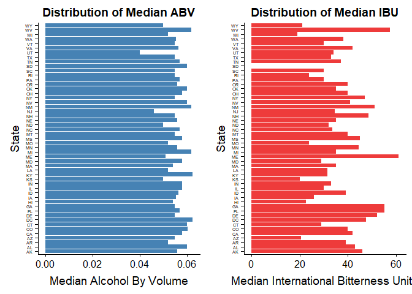

## Load Libraries

```r
# Load Libraries
library(cowplot)
library(plyr)
library(ggplot2)
```

# Read in and Setup Data

```r
# Create Data Frames from CSV files
beers <- read.csv(file="data/Beers.csv", stringsAsFactors=FALSE, header = TRUE, sep = ",")
breweries <- read.csv(file = "data/Breweries.csv", stringsAsFactors=FALSE, header = TRUE, sep = ",")

# Check the Class of each 
class(beers)
```

```
## [1] "data.frame"
```

```r
class(breweries)
```

```
## [1] "data.frame"
```

```r
# Check the structure of data frame
str(beers)
```

```
## 'data.frame':	2410 obs. of  7 variables:
##  $ Name      : chr  "Pub Beer" "Devil's Cup" "Rise of the Phoenix" "Sinister" ...
##  $ Beer_ID   : int  1436 2265 2264 2263 2262 2261 2260 2259 2258 2131 ...
##  $ ABV       : num  0.05 0.066 0.071 0.09 0.075 0.077 0.045 0.065 0.055 0.086 ...
##  $ IBU       : int  NA NA NA NA NA NA NA NA NA NA ...
##  $ Brewery_id: int  409 178 178 178 178 178 178 178 178 178 ...
##  $ Style     : chr  "American Pale Lager" "American Pale Ale (APA)" "American IPA" "American Double / Imperial IPA" ...
##  $ Ounces    : num  12 12 12 12 12 12 12 12 12 12 ...
```

```r
str(breweries)
```

```
## 'data.frame':	558 obs. of  4 variables:
##  $ Brew_ID: int  1 2 3 4 5 6 7 8 9 10 ...
##  $ Name   : chr  "NorthGate Brewing " "Against the Grain Brewery" "Jack's Abby Craft Lagers" "Mike Hess Brewing Company" ...
##  $ City   : chr  "Minneapolis" "Louisville" "Framingham" "San Diego" ...
##  $ State  : chr  " MN" " KY" " MA" " CA" ...
```

```r
# Change Brew_ID to Brewery_id so that both data frames have the same
# column name for Brewery ID
names(breweries)[1] <- "Brewery_id"

# Change Name in both data frame to a more descriptive column name
names(breweries)[2] <- "Brewery_name"
names(beers)[1] <- "Beer_name"
```

# Introduction

Breweries and Beers created, made, developed and loved in the United States. 

* include details about the beers, and breweries
* Mr. Customer the following is a detailed analysis answering the 7 questions of interest.
  
# Analysis

## Question of Interest 1 
### Number of Breweries in Each State

```r
library(knitr)
kable(table(breweries$State), caption = "Table of Beers Per State", col.names = c("State", "Beer Count"), align = "l")
```


Table: Table of Beers Per State

State   Beer Count 
------  -----------
AK      7          
AL      3          
AR      2          
AZ      11         
CA      39         
CO      47         
CT      8          
DC      1          
DE      2          
FL      15         
GA      7          
HI      4          
IA      5          
ID      5          
IL      18         
IN      22         
KS      3          
KY      4          
LA      5          
MA      23         
MD      7          
ME      9          
MI      32         
MN      12         
MO      9          
MS      2          
MT      9          
NC      19         
ND      1          
NE      5          
NH      3          
NJ      3          
NM      4          
NV      2          
NY      16         
OH      15         
OK      6          
OR      29         
PA      25         
RI      5          
SC      4          
SD      1          
TN      3          
TX      28         
UT      4          
VA      16         
VT      10         
WA      23         
WI      20         
WV      1          
WY      4          

## Question of Interest 2 
### Merged Dataset, First 6 and Last 6 observations

```r
beers_brews <- merge(beers, breweries, by="Brewery_id", all=TRUE)
head(beers_brews, 6)
```

```
##   Brewery_id     Beer_name Beer_ID   ABV IBU
## 1          1  Get Together    2692 0.045  50
## 2          1 Maggie's Leap    2691 0.049  26
## 3          1    Wall's End    2690 0.048  19
## 4          1       Pumpion    2689 0.060  38
## 5          1    Stronghold    2688 0.060  25
## 6          1   Parapet ESB    2687 0.056  47
##                                 Style Ounces       Brewery_name
## 1                        American IPA     16 NorthGate Brewing 
## 2                  Milk / Sweet Stout     16 NorthGate Brewing 
## 3                   English Brown Ale     16 NorthGate Brewing 
## 4                         Pumpkin Ale     16 NorthGate Brewing 
## 5                     American Porter     16 NorthGate Brewing 
## 6 Extra Special / Strong Bitter (ESB)     16 NorthGate Brewing 
##          City State
## 1 Minneapolis    MN
## 2 Minneapolis    MN
## 3 Minneapolis    MN
## 4 Minneapolis    MN
## 5 Minneapolis    MN
## 6 Minneapolis    MN
```

```r
tail(beers_brews, 6)
```

```
##      Brewery_id                 Beer_name Beer_ID   ABV IBU
## 2405        556             Pilsner Ukiah      98 0.055  NA
## 2406        557  Heinnieweisse Weissebier      52 0.049  NA
## 2407        557           Snapperhead IPA      51 0.068  NA
## 2408        557         Moo Thunder Stout      50 0.049  NA
## 2409        557         Porkslap Pale Ale      49 0.043  NA
## 2410        558 Urban Wilderness Pale Ale      30 0.049  NA
##                        Style Ounces                  Brewery_name
## 2405         German Pilsener     12         Ukiah Brewing Company
## 2406              Hefeweizen     12       Butternuts Beer and Ale
## 2407            American IPA     12       Butternuts Beer and Ale
## 2408      Milk / Sweet Stout     12       Butternuts Beer and Ale
## 2409 American Pale Ale (APA)     12       Butternuts Beer and Ale
## 2410        English Pale Ale     12 Sleeping Lady Brewing Company
##               City State
## 2405         Ukiah    CA
## 2406 Garrattsville    NY
## 2407 Garrattsville    NY
## 2408 Garrattsville    NY
## 2409 Garrattsville    NY
## 2410     Anchorage    AK
```

## Question of Interest 3 
### Report the number of NAs in each column

```r
colSums(is.na(beers_brews))
```

```
##   Brewery_id    Beer_name      Beer_ID          ABV          IBU 
##            0            0            0           62         1005 
##        Style       Ounces Brewery_name         City        State 
##            0            0            0            0            0
```

## Question of Interest 4 
### Compute the median alcohol content and international bitterness unit for each state. Plot a bar chart to compare.

```r
median_abv <- tapply(beers_brews$ABV, beers_brews$State, median, na.rm = T)
median_ibu <- tapply(beers_brews$IBU, beers_brews$State, median, na.rm = T)
```

#### Median Alcohol by Volume

```r
median_abv
```

```
##     AK     AL     AR     AZ     CA     CO     CT     DC     DE     FL 
## 0.0560 0.0600 0.0520 0.0550 0.0580 0.0605 0.0600 0.0625 0.0550 0.0570 
##     GA     HI     IA     ID     IL     IN     KS     KY     LA     MA 
## 0.0550 0.0540 0.0555 0.0565 0.0580 0.0580 0.0500 0.0625 0.0520 0.0540 
##     MD     ME     MI     MN     MO     MS     MT     NC     ND     NE 
## 0.0580 0.0510 0.0620 0.0560 0.0520 0.0580 0.0550 0.0570 0.0500 0.0560 
##     NH     NJ     NM     NV     NY     OH     OK     OR     PA     RI 
## 0.0550 0.0460 0.0620 0.0600 0.0550 0.0580 0.0600 0.0560 0.0570 0.0550 
##     SC     SD     TN     TX     UT     VA     VT     WA     WI     WV 
## 0.0550 0.0600 0.0570 0.0550 0.0400 0.0565 0.0550 0.0555 0.0520 0.0620 
##     WY 
## 0.0500
```

#### Median Internation Bitterness Units

```r
median_ibu
```

```
##   AK   AL   AR   AZ   CA   CO   CT   DC   DE   FL   GA   HI   IA   ID   IL 
## 46.0 43.0 39.0 20.5 42.0 40.0 29.0 47.5 52.0 55.0 55.0 22.5 26.0 39.0 30.0 
##   IN   KS   KY   LA   MA   MD   ME   MI   MN   MO   MS   MT   NC   ND   NE 
## 33.0 20.0 31.5 31.5 35.0 29.0 61.0 35.0 44.5 24.0 45.0 40.0 33.5 32.0 35.0 
##   NH   NJ   NM   NV   NY   OH   OK   OR   PA   RI   SC   SD   TN   TX   UT 
## 48.5 34.5 51.0 41.0 47.0 40.0 35.0 40.0 30.0 24.0 30.0   NA 37.0 33.0 34.0 
##   VA   VT   WA   WI   WV   WY 
## 42.0 30.0 38.0 19.0 57.5 21.0
```

#### create data frames from the above medians to be used in Graphs

```r
med_abv_df <- data.frame(template=names(median_abv), median=median_abv, stringsAsFactors = FALSE)
colnames(med_abv_df) <- (c("State", "ABV"))
med_ibu_df <- data.frame(template=names(median_ibu), median=median_ibu, stringsAsFactors = FALSE)
colnames(med_ibu_df) <- (c("State", "IBU"))
# Merge the two together
abv_ibu <- merge(med_abv_df, med_ibu_df, by="State")
```

#### Ditributions of ABV and IBU

```r
plot1 <- ggplot(abv_ibu, aes(x = State, y = ABV)) + 
  geom_bar(stat = "identity", fill="steelblue") +
  coord_flip() +
  xlab("State") + ylab("Median Alcohol By Volume") + 
  ggtitle("Distribution of Median ABV by State") +
  theme(axis.text.y = element_text(size = 5))
plot2 <- ggplot(abv_ibu, aes(x = State, y = IBU)) + 
  geom_bar(stat = "identity", fill="brown2") + 
  coord_flip() +
  xlab("State") + ylab("Median International Bitterness Units") + 
  ggtitle("Distribution of Median IBU by State") + 
  theme(axis.text.y = element_text(size = 5))
plot_grid(plot1, plot2)
```

<!-- -->


## Question of Interest 5 State with the most ABV and which with the most IBU

### State with the Highest ABV (ALL)

```r
beers_brews[which.max(beers_brews$ABV), ]
```

```
##     Brewery_id                                            Beer_name
## 375         52 Lee Hill Series Vol. 5 - Belgian Style Quadrupel Ale
##     Beer_ID   ABV IBU            Style Ounces            Brewery_name
## 375    2565 0.128  NA Quadrupel (Quad)   19.2 Upslope Brewing Company
##        City State
## 375 Boulder    CO
```

##### Only State Abbreviation

```r
beers_brews[which.max(beers_brews$ABV), ]$State
```

```
## [1] " CO"
```

#### State with the Highest IBU (ALL)

```r
beers_brews[which.max(beers_brews$IBU), ]
```

```
##      Brewery_id                 Beer_name Beer_ID   ABV IBU
## 1857        375 Bitter Bitch Imperial IPA     980 0.082 138
##                               Style Ounces            Brewery_name    City
## 1857 American Double / Imperial IPA     12 Astoria Brewing Company Astoria
##      State
## 1857    OR
```

##### Only State Abbreviation

```r
  beers_brews[which.max(beers_brews$IBU), ]$State
```

```
## [1] " OR"
```

# Question of Interest 6 Summary Statistics of Alcohol by Volume

```r
summary(na.omit(beers$ABV))
```

```
##    Min. 1st Qu.  Median    Mean 3rd Qu.    Max. 
## 0.00100 0.05000 0.05600 0.05977 0.06700 0.12800
```

# Question 7 ScatterPlot of the Relationship Between IBU and ABV

```r
pp<- ggplot(beers, aes(x=ABV, y=IBU)) +
  geom_point(aes(col=IBU, size=ABV)) +
  geom_smooth(method="loess", se=F) +
  xlim(c(0, 0.14)) + ylim(c(0, 140)) +
  labs(y = "International Bitterness Units",
       x = "Alcohol by Volume") +
  ggtitle("Relationship between International Bitterness Unit and Alcohol by Volume") +
  theme(plot.title = element_text(hjust=0.5)) +
  theme_gray()
plot(pp)
```

<!-- -->
